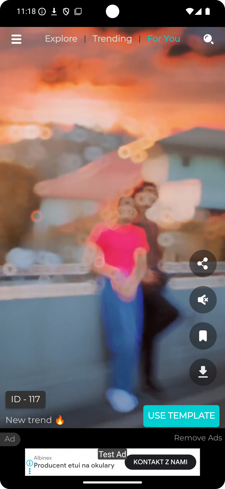
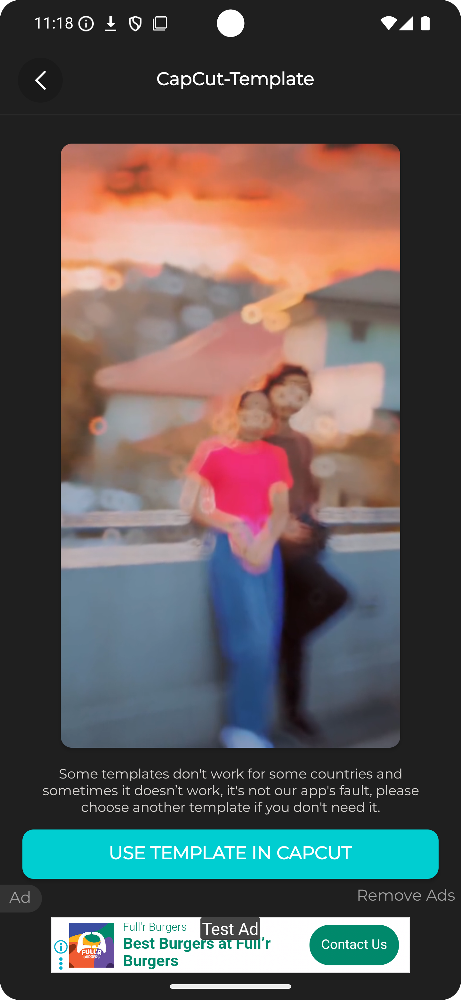
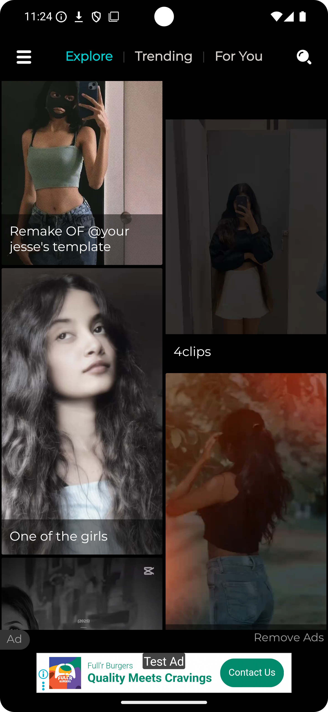
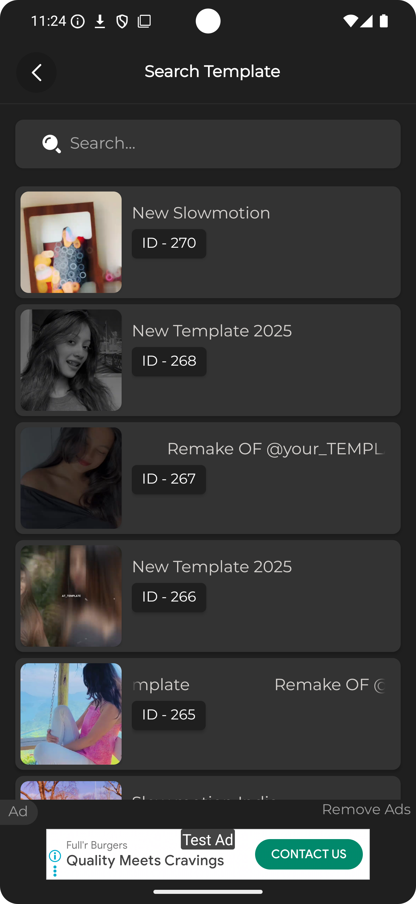
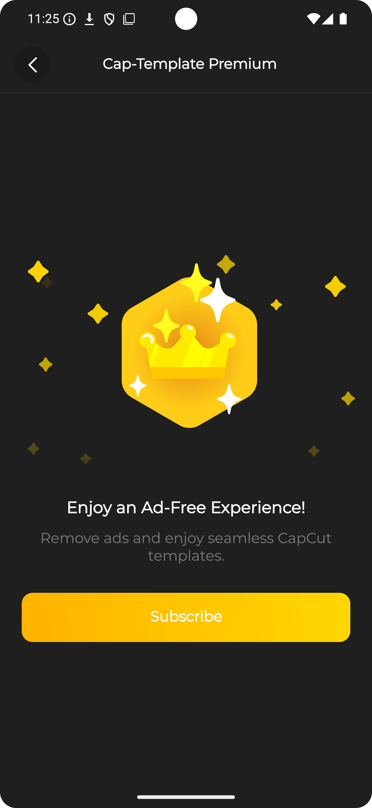
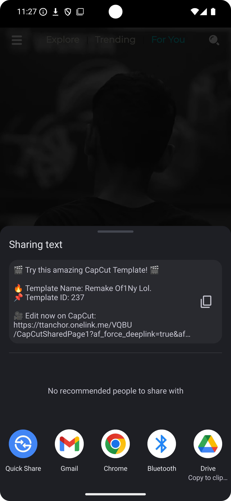
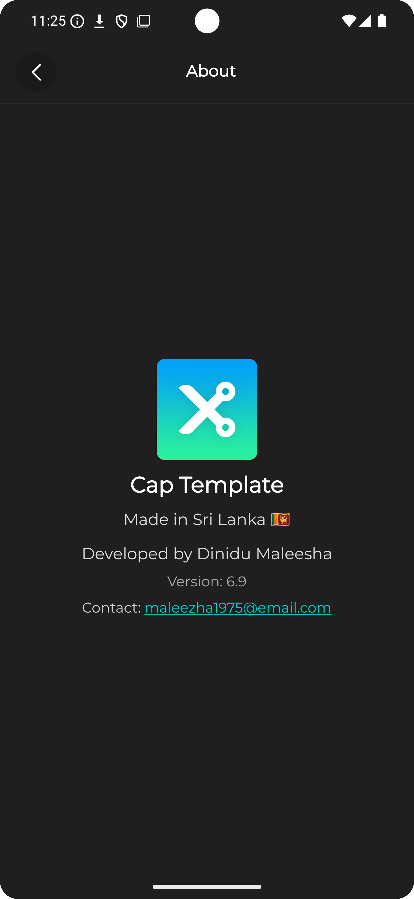

# 🎬 Cap Template - CapCut Template  

**Cap Template** is a lightweight and convenient tool for exploring and using pre-made **CapCut video templates**.  
Easily import your photos and videos to create professional-quality edits in just a few taps — powered by templates shared by the community.  

---

## 🌟 Features  

- 🎥 **Quick Video Creation** – Use pre-made CapCut templates for fast and easy editing.  
- 🌍 **Community Templates** – Explore and apply templates created by other editors.  
- 📸 **Import Media** – Add your own photos and videos to personalize templates.  
- 🔒 **Locked Settings** – Templates come with ready-made configurations for convenience.  
- 🌓 **Dark Mode** – Smooth editing experience with dark mode support.  
- 🎶 **Music & Effects** – Enhance your edits with pre-configured sound and visuals.  

---

## 📸 Screenshots  

<table>
  <tr>
    <td></td>
    <td></td>
    <td></td>
  </tr>
  <tr>
    <td></td>
    <td></td>
    <td></td>
  </tr>
  <tr>
    <td></td>
    <td></td>
    <td></td>
  </tr>
</table>

---

## 🚀 Getting Started  

1. Download **Cap Template - CapCut Template** from the [Google Play Store](https://play.google.com/store/apps/details?id=com.boomstudio.capcuttemplate).  
2. Browse and select a template you like.  
3. Import your photos/videos and watch them transform into stunning edits.  

---

## 📦 App Information  

- **App Name**: Cap Template - CapCut Template  
- **Requires Android**: 5.0 and up  
- **Release Date**: October 17, 2022  
- **Offered By**: Boom Studio LK  
- **Developer**: Dinidu Maleesha  

---

## 📧 Contact  

For feedback, support, or inquiries:  
📩 **Email**: boommusic950@gmail.com  

---

© Boom Studio LK.  
All templates belong to their respective creators. This app provides access to **CapCut templates** with preset configurations.  

